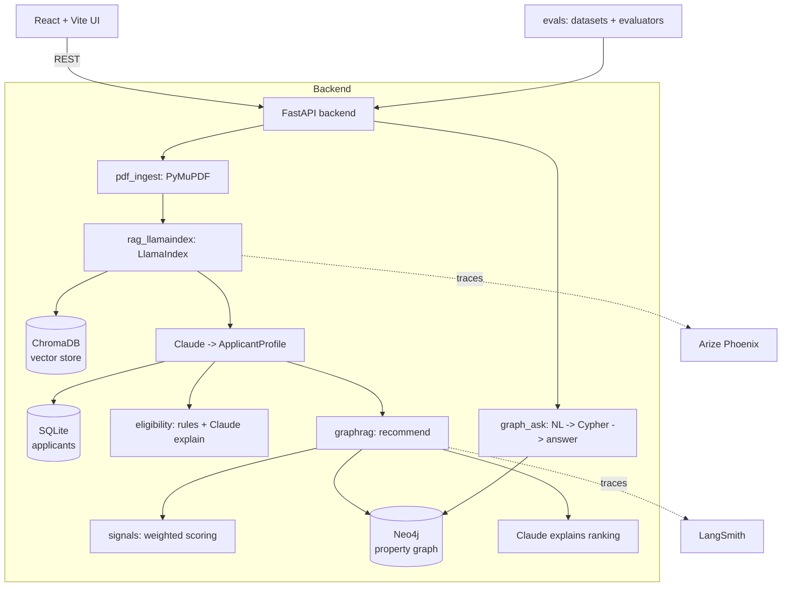
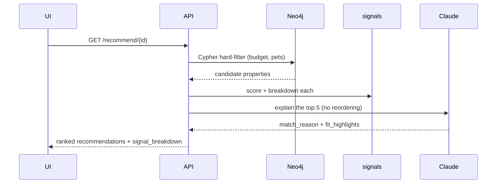
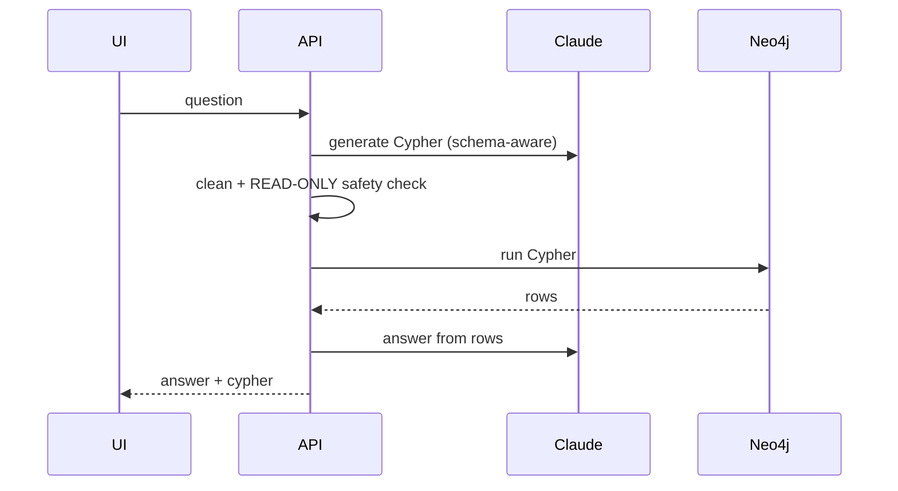

# Architecture

RentReady turns a renter's application PDF into an eligibility decision and
ranked property recommendations, and is wired end-to-end for **evaluation and
observability**.

## System overview



## The headline design decision: deterministic scorer, LLM explainer

The recommendation ranking is **100% deterministic** (`signals.py`): each
property gets a weighted score from 11 sub-signals, and the LLM is told
explicitly *not* to reorder or change scores — it only writes the plain-English
explanation. This makes the ranking:

- **Reproducible** — same inputs, same order, every time.
- **Testable** — `test_graphrag.py` + the eval suite assert exact behavior.
- **Explainable** — the per-signal `signal_breakdown` is returned and charted.

The same split applies to eligibility: deterministic rules decide the verdict;
Claude only phrases it kindly.

### Scoring contract (`signals.py`)

```
score(P, A) = Σ wᵢ·sᵢ(P, A) / Σ wᵢ      over signals present in A
```

Each `sᵢ ∈ [0,1]`; weights sum to 1.0 and are **renormalized over the signals
the applicant actually specified**, so missing data never penalizes a property.
Signals: affordability, area, amenities, bedrooms, budget, bathrooms, transit,
square feet, parking, balcony, laundry.

## Request lifecycles

### `POST /recommend/{id}` (GraphRAG)


### `POST /graph-ask` (text-to-Cypher)


## Data model (Neo4j)

```
(:Property {id, name, property_type, monthly_rent, bedrooms, bathrooms,
            bathroom_type, square_feet, has_balcony, in_unit_laundry,
            parking_type, pets_allowed, lease_term_months, furnished})
(:Neighborhood {name, city, walk_score, transit_score})
(:Amenity {name})

(:Property)-[:IN_NEIGHBORHOOD]->(:Neighborhood)
(:Property)-[:OFFERS]->(:Amenity)
```

## Graceful degradation (fallback matrix)

| Dependency | Present | Absent |
|---|---|---|
| `ANTHROPIC_API_KEY` | Real Claude extraction/explanations | Mock answer + heuristic extraction |
| HuggingFace embeddings | Semantic vectors | Offline hashing embedder |
| Neo4j | Graph queries | In-memory property filtering |
| LangSmith / Phoenix keys | Live tracing | Silently skipped |

This is why the app runs with **zero configuration** and the test/eval suites
run fully offline in CI.

## Observability

- **LangSmith** traces the LangChain side (recommendations, eligibility, graph-ask).
- **Arize Phoenix** (local) traces the LlamaIndex side (PDF RAG).

Two lenses on the same request, by design — each tool is strongest for the
framework it instruments.
