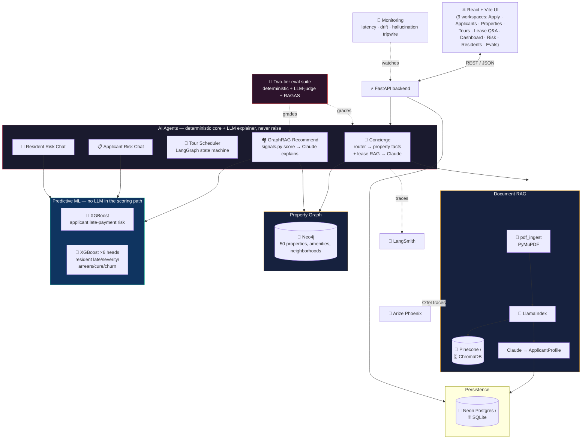
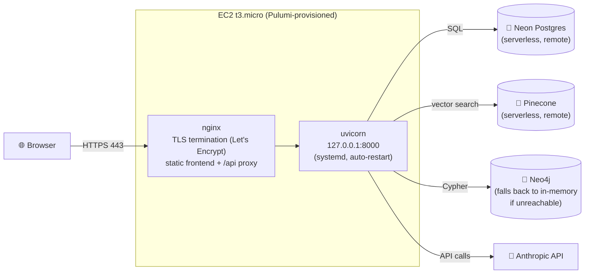

# 🏠 RentReady — AI Rental Operations Platform

**A full-stack, production-shaped AI application for the entire renter lifecycle** — application intake → eligibility → property matching → tour booking → lease Q&A → in-tenancy risk & retention — with **every AI decision deterministic-first, explainable, evaluated, and traced.**

This isn't a chatbot wrapper. It's five independent AI agents (Concierge, Recommendations, Tour Scheduler, Applicant Risk, Resident Risk) sharing one hard rule: **the model never decides — it only explains a deterministic decision.** That rule, plus a two-tier evaluation suite that gates CI, is the whole design philosophy.

> Runs with **zero configuration.** No API keys required — a mock LLM, an offline embedder, in-memory graph fallback, and heuristic ML models kick in automatically. Add an `ANTHROPIC_API_KEY` and everything upgrades to real Claude reasoning, live tracing, and trained XGBoost models — same code path either way.

---

## ⚡ Tech Stack

<table>
<tr><td valign="top">

**AI / LLM Orchestration**
- 🤖 **Claude (Sonnet 5)** via Anthropic + LangChain
- 🔗 **LangChain** + **LangGraph** (stateful chat flows)
- 📚 **LlamaIndex** (RAG pipeline + profile extraction)
- 🕸️ **GraphRAG** (`neo4j-graphrag`, text-to-Cypher)
- 🎯 **FlashRank** + **RapidFuzz** (hybrid rerank)

</td><td valign="top">

**Data & Retrieval**
- 🐘 **Postgres** (Neon, serverless) via **SQLAlchemy Core**
- 🗄️ **SQLite** (local/test default, same code path)
- 🌲 **Pinecone** (serverless vector DB) or **ChromaDB** (local)
- 🧠 **Neo4j** property graph (Cypher, APOC)
- 🤗 **HuggingFace sentence-transformers** (offline-capable embeddings)

</td></tr>
<tr><td valign="top">

**Machine Learning**
- 🌳 **XGBoost** multi-head classifiers/regressors
- 📈 **scikit-learn** (HistGradientBoosting fallback heads)
- 🎚️ Deterministic weighted scoring engine (11 signals, zero ML)
- 🔍 Reason-codes + SHAP-style feature attribution

</td><td valign="top">

**Evaluation & Observability**
- ⚖️ **LLM-as-judge** (Claude, temp-0 JSON guardrails)
- 📊 **RAGAS** (faithfulness / relevancy / correctness)
- 🧪 **LangSmith** (tracked experiments + tracing)
- 🔭 **Arize Phoenix** (OpenTelemetry LLM tracing)
- 🚦 Online monitoring: drift detection, hallucination tripwire, A/B lab

</td></tr>
<tr><td valign="top">

**Backend**
- ⚡ **FastAPI** + **Pydantic v2** + **pydantic-settings**
- 📄 **PyMuPDF** / **unstructured** (PDF parsing + generation)
- 🐍 **uv** for fast, reproducible Python envs

</td><td valign="top">

**Frontend**
- ⚛️ **React 18** + **TypeScript** + **Vite**
- 🎨 **Framer Motion**, **Recharts**, **Lucide** icons
- ✅ **Vitest** + **Testing Library** + **Playwright** (e2e)

</td></tr>
<tr><td valign="top">

**Infrastructure**
- ☁️ **AWS EC2** provisioned via **Pulumi** (Python IaC)
- 🔒 **nginx** + **Let's Encrypt/certbot** (auto TLS, no domain purchase — `sslip.io`)
- 🐳 **Neo4j** via Podman/Docker (local dev)
- 🔁 **GitHub Actions CI** — deterministic eval suite gates every merge

</td><td valign="top">

**Safety by construction**
- 🚫 Read-only Cypher guard on all LLM-generated graph queries
- 🛡️ Protected-class features structurally excluded from every ML model
- 🧯 Every agent has a "never raises" outer guard → templated fallback

</td></tr>
</table>

## What this demonstrates

| Capability | How it's shown here |
|---|---|
| RAG over documents | LlamaIndex + ChromaDB/Pinecone; PDF → chunks → grounded Q&A, hybrid dense+lexical retrieval for lease docs |
| GraphRAG | Neo4j property graph + `langchain-neo4j`; text-to-Cypher Q&A and graph-constrained recommendations |
| Multi-agent chat | 5 independent agents — Concierge, Recommendation explainer, Tour Scheduler (LangGraph), Applicant Risk chat, Resident Risk chat |
| Reliable LLM design | **Deterministic core; the LLM only explains/phrases** — reproducible, testable, and every agent degrades to a templated answer on any LLM failure |
| Predictive ML | Two independent XGBoost bundles — applicant late-payment risk, and a 6-head resident risk model (late/frequency/severity/arrears/cure/retention) — both with a transparent heuristic fallback |
| Evaluation / LLMOps | Deterministic suites (accuracy, field-accuracy, NDCG@5, calibration) with a **CI regression gate**, plus **LLM-as-judge**, **RAGAS**, tracked **LangSmith experiments**, and an **A/B Lab** |
| Monitoring (online) | Live telemetry (latency p50/p95, hallucination tripwire), drift detection, alert rules, optional Datadog sink, quality-trend charts |
| Observability | Dual tracing — LangSmith (LangChain) + Arize Phoenix (LlamaIndex) |
| Explainable AI | Per-signal `signal_breakdown` radar charts, reason codes, eligibility gauge, citations everywhere |
| Fair-lending safety | Protected-class proxies (location, familial status, age, …) are structurally excluded from every model's feature set — not just unused, absent from the vector |
| Graceful degradation | Mock LLM + offline embeddings + in-memory graph + heuristic ML fallbacks — the whole stack runs with zero keys |
| Full-stack + cloud | FastAPI + React/Vite/TS, dual persistence (SQLite/Postgres), CI, and a real AWS deployment (Pulumi IaC, HTTPS) |

## Evaluation results

Deterministic tier (gates CI):

| Metric | Score | Threshold |
|---|---|---|
| Eligibility accuracy | **100%** | 100% |
| Extraction field accuracy | **100%** | 90% |
| Recommendation NDCG@5 | **85%** | 70% |

LLM tier (Claude as judge + RAGAS):

| Metric | Score |
|---|---|
| Judge groundedness | **93%** |
| Eligibility-explanation consistency | **100%** |
| RAGAS faithfulness / correctness | **100% / 90%** |

The deterministic tier runs in CI on every push and **fails the build on
regression**. The LLM-as-judge actually caught a real bug — recommendation
explanations were hallucinating amenities (groundedness 0.30) until we fed the
judge and the explainer the same facts (0.93). See [EVALUATION.md](EVALUATION.md).

## Key design decision

Every agent in this app follows the same rule: **an LLM never makes the
decision — it only explains one already made deterministically.**

- **Recommendations** (`backend/signals.py`): 11 weighted signals
  (affordability, area, bedrooms, transit, …), renormalized over whichever
  signals the applicant actually specified so missing data never penalizes a
  property. Claude explains the top 5; it's told explicitly not to reorder them.
- **Eligibility** (`backend/eligibility.py`): rules decide qualified /
  declined / needs-review; Claude only phrases the reasoning.
- **Applicant & resident risk** (`backend/risk.py`, `backend/residents_risk.py`):
  XGBoost heads produce probabilities and reason codes; there is no LLM in the
  scoring path at all — chat agents built on top only narrate the numbers.
- **Tour Scheduler** (`backend/tours_chat.py`) and **Graph Ask**
  (`backend/graphrag.py`): an LLM may rewrite wording or write a Cypher query,
  but a deterministic guard (safe-slot computation, read-only Cypher check)
  bounds what it's allowed to produce — and every agent **never raises**,
  falling back to a templated response on any LLM error.

Reproducible, testable outputs — plus natural-language reasoning on top.

## Architecture



### Deployment topology (AWS)



For the full request-lifecycle sequence diagrams (recommend, graph-ask,
tour booking) and the Neo4j data model, see [ARCHITECTURE.md](ARCHITECTURE.md).

## Quickstart

Prerequisites: Python 3.9+, Node 18+, Podman (or Docker).

```bash
# 1. Graph database
make neo4j

# 2. Backend (in its own terminal)
python3 -m venv .venv && source .venv/bin/activate
pip install -r backend/requirements.txt
cp .env.example .env          # optional: add ANTHROPIC_API_KEY + LANGSMITH_API_KEY
make backend                  # http://localhost:8000

# 3. Frontend (in its own terminal)
cd frontend && npm install && npm run dev   # http://localhost:5173

# 4. (optional) Phoenix trace UI + run evals
make phoenix                  # http://localhost:6006
make eval
```

Open http://localhost:5173, click a **sample applicant**, and explore the
**Workspace** (profile → eligibility → recommendations → chat → graph-ask),
**Tours** (book a tour with a per-property dedicated agent), **Risk
Assessment** and **Residents** (predictive risk chat + KPIs), the
**Evaluations** dashboard (deterministic + LLM tier), **Monitoring** (quality
trends over time), and the **A/B Lab** (compare two prompts/models head-to-head).

Every view is deep-linkable (`#/residents/PROP-041/RES-0018`,
`#/property/PROP-007`, `#/risk/APP-123`, …) — the URL hash is the single
source of truth for navigation state.

## Project layout

```
backend/
  main.py             FastAPI app + applicant CRUD + routers
  pdf_ingest.py        PDF -> text (PyMuPDF/unstructured)
  rag_llamaindex.py    LlamaIndex RAG + profile extraction (Chroma or Pinecone)
  graph.py             Neo4j seed + candidate query (+ memory fallback)
  graphrag.py          recommend() + graph_ask() (read-only guard)
  signals.py           transparent weighted scoring (recommendations)
  eligibility.py       rules + Claude explanation
  concierge.py         property/lease Q&A agent (router -> tools -> synthesize)
  knowledge.py         hybrid RAG over lease documents
  tours.py / tours_api.py / tours_chat.py / tours_graph.py
                       tour scheduling: dedicated agent per property, LangGraph chat
  risk.py / risk_api.py / risk_chat.py
                       applicant late-payment risk (XGBoost + heuristic fallback)
  residents_risk.py / resident_api.py / residents_chat.py
                       resident risk: 6-head model (late/frequency/severity/
                       arrears/cure/retention), reason codes, portfolio KPIs
  store.py             SQLite or Postgres persistence (SQLAlchemy Core)
  eval_api.py          /evals endpoints (suites, run, history, judge, ragas, langsmith)
  evals/               datasets + evaluators + judges (LLM) + RAGAS + LangSmith + runner
  observability.py     LangSmith + Phoenix
  monitoring.py        online quality/latency/drift monitoring
  tests/               pytest (offline, deterministic)
frontend/              React + Vite + TS (9 workspaces + evaluations + monitoring + A/B)
infra/                 Pulumi IaC (EC2 + nginx + certbot bootstrap) for AWS deployment
data/                  properties.json + sample application PDFs
.github/workflows/     CI
```

## Tests

```bash
make test     # backend pytest + frontend vitest
```

## Endpoints

`POST /upload` · `GET /applicants` · `GET|DELETE /applicants/{id}` ·
`GET /eligibility/{id}` · `GET /recommend/{id}` · `POST /ask` ·
`POST /graph-ask` · `POST /concierge/ask` · `POST /tours/*` ·
`GET|POST /risk/*` · `GET|POST /residents/*` ·
`POST /evals/run` · `GET /evals/latest` · `GET /evals/history` ·
`POST /evals/judge` · `POST /evals/ragas` · `POST /evals/langsmith` ·
`GET /evals/ab/variants` · `POST /evals/ab/run` ·
`POST /feedback` · `GET /monitoring/overview` · `POST /monitoring/push-datadog` ·
`GET /health`
