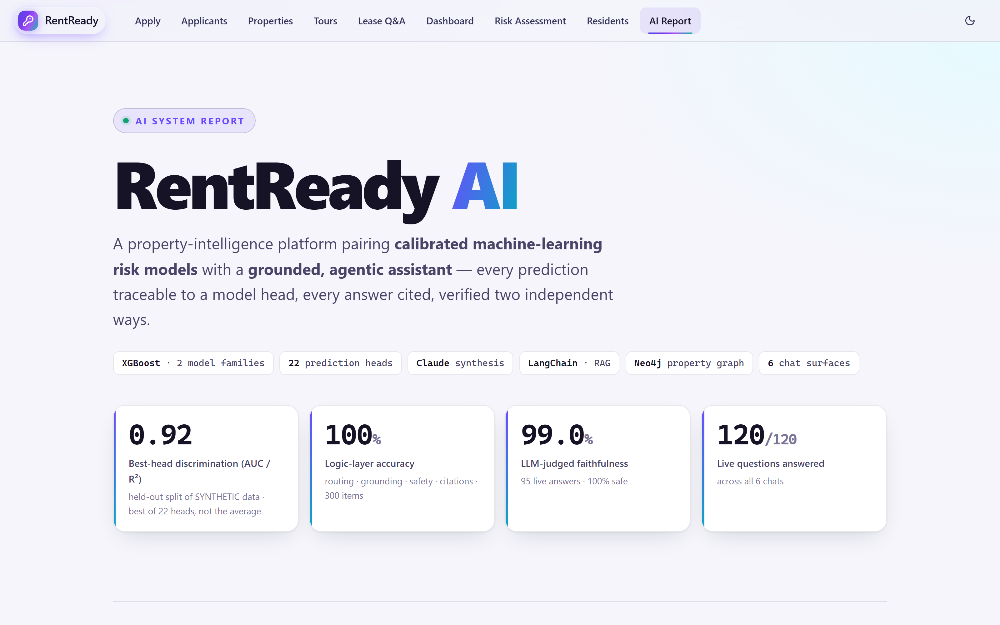

# 📊 RentReady — AI Performance Report

Measured results for the two model families and six chat surfaces behind
[RentReady](../README.md). Every ML number on this page is read straight from the
deployed model artifact — `GET /api/health` on the
[live demo](https://13-59-120-53.sslip.io/api/health) returns the same figures, so
nothing here has to be taken on trust.

**Three ways to read this report:**

| | |
|---|---|
| 📄 **This page** | Renders on GitHub, no server needed — full 24-head table below |
| 🖥️ **Interactive version** | [In the live app](https://13-59-120-53.sslip.io/#/report) — charts, and the same numbers |
| 🎨 **Standalone HTML** | [`docs/reports/ai_showcase.html`](reports/ai_showcase.html) — self-contained, opens offline |

> ### ⚠️ Read these numbers carefully
>
> **All training and evaluation data is SYNTHETIC**, generated by a parametric
> simulator (`backend/generate_residents.py`). Metrics are measured on a held-out split
> of *that same generator*, so they show the pipeline reliably recovers a **known
> data-generating process** — they are **not** evidence of real-world predictive skill
> on actual residents. Two features (`rent_to_income`, lateness recency) are near-exact
> algebraic inverses of latent terms in the simulator's own equation, so some of the
> reported performance is the model re-learning that equation.
>
> This is why every head below is shown **next to the naive baseline it has to beat.**

---

## Applicant late-payment risk

Single-head XGBoost, 16,000 samples (12,000 train / 4,000 held-out test), 15 features.

| Metric | Value | Reading |
|---|---|---|
| ROC-AUC | **0.784** | Ranks a random late payer above a random on-time payer 78% of the time |
| Brier score | **0.135** | vs 0.171 for predicting the 22.0% base rate every time |
| Calibration error (ECE) | **0.021** | When it says 30%, ≈30% of those applicants are late |
| PR-AUC | 0.533 | At a 22.0% base rate |

Calibration is the number that matters for this use case: the output is shown to a human
as a probability, so it has to *mean* something. A 0.021 ECE means the stated percentage
is within ~2 points of the observed rate.

---

## Resident risk — all 24 heads vs. their baselines

Every head is scored against the trivial predictor it must beat: **persistence** ("assume
the balance doesn't change") for dollar heads, **predict-the-mean** for counts,
**predict-the-base-rate** for classifiers. `n_test` = 300 residents.

**Result: 18 heads beat their baseline, 1 ties, 3 lose.** All 22 comparisons below;
the two remaining heads (`delinquency_bucket_12m`, `months_to_cure`) have no
single-number baseline and are reported separately.

| Family | Head | Discrimination | Model | Naive baseline | Verdict |
|---|---|---|---|---|:--|
| late | `late_1m` | AUC 0.683 | Brier 0.178 | base-rate 0.186 | ✅ model |
| late | `late_3m` | AUC 0.815 | Brier **0.176** | base-rate 0.242 | ✅ model |
| late | `late_6m` | AUC 0.800 | Brier 0.183 | base-rate 0.246 | ✅ model |
| late | `late_12m` | AUC 0.822 | Brier **0.157** | base-rate 0.210 | ✅ model |
| frequency | `late_count_3m` | R² 0.307 | MAE 0.58 mo | mean 0.84 | ✅ model |
| frequency | `late_count_6m` | R² 0.488 | MAE 0.87 mo | mean 1.43 | ✅ model |
| frequency | `late_count_9m` | R² 0.586 | MAE 1.18 mo | mean 2.06 | ✅ model |
| frequency | `late_count_12m` | R² 0.621 | MAE **1.45 mo** | mean 2.62 | ✅ model |
| frequency | `missed_count_12m` | R² 0.299 | MAE 0.37 mo | mean 0.58 | ✅ model |
| severity | `max_days_late_12m` | R² 0.380 | MAE 11.6 days | mean 15.9 | ✅ model |
| severity | `p_30d_12m` | AUC 0.826 | Brier **0.158** | base-rate 0.222 | ✅ model |
| severity | `p_60d_12m` | AUC 0.667 | Brier 0.060 | base-rate 0.062 | ⚠️ marginal |
| severity | `p_90d_12m` | AUC **0.522** | Brier 0.026 | base-rate 0.026 | ➖ tie (chance) |
| severity | `serious` | AUC 0.823 | Brier **0.094** | base-rate 0.158 | ✅ model |
| arrears | `arrears_3m` | R² 0.893 | MAE $334 | persistence **$242** | ❌ baseline |
| arrears | `arrears_6m` | R² 0.916 | MAE $374 | persistence **$333** | ❌ baseline |
| arrears | `arrears_9m` | R² 0.913 | MAE **$416** | persistence $426 | ✅ model (narrow) |
| arrears | `arrears_12m` | R² 0.816 | MAE $506 | persistence **$461** | ❌ baseline |
| arrears | `peak_balance_12m` | R² 0.890 | MAE **$678** | persistence $758 | ✅ model |
| cure | `p_cure_6m` | AUC **0.888** | Brier 0.134 | base-rate 0.249 | ✅ model |
| retention | `churn` | AUC 0.773 | Brier 0.180 | base-rate 0.238 | ✅ model |
| retention | `churn_12m` | AUC 0.734 | Brier 0.198 | base-rate 0.237 | ✅ model |

Without a baseline column: `delinquency_bucket_12m` (5-class worst-delinquency bucket,
accuracy 0.503, log-loss 1.038) and `months_to_cure` (discrete-time hazard, AUC 0.869
over 434 person-periods).

### Where the models do *not* beat doing nothing

Three findings that a headline metric would have hidden:

**1. The arrears family's impressive R² is mostly autocorrelation.** `arrears_6m` reports
R² 0.916 — which looks excellent until you write the one-line baseline. Near-term arrears
are dominated by the balance a resident is *already* carrying, so "assume it doesn't
change" beats the model on 3 of 5 dollar heads. Only `peak_balance_12m` clearly earns its
model.

**2. `p_90d_12m` is at chance.** AUC 0.522, and its Brier score (0.026) is *identical* to
predicting the base rate. Its flattering 0.011 ECE reflects how rare the event is
(~8 positives in a 300-row test split), not skill. It's flagged `low_confidence` in the
head registry and surfaced as "low power" in the in-app model card.

**3. `p_60d_12m` is marginal** — Brier 0.060 vs a 0.062 baseline. Also
`low_confidence`.

These are visible because `train_residents.py` emits a `baseline_*` figure alongside every
head and serves it on `/health`. The alternative — reporting R² 0.916 and moving on — would
have been easier and wrong.

---

## Chat evaluation — verified two independent ways

Six chat surfaces, evaluated by a **deterministic logic layer** (model off, fully
reproducible) *and* by an **LLM-as-judge** over live Claude prose. Two methods that fail
differently.

### Method 1 — logic layer (deterministic, LLM off)

| Surface | Items | Routing | Grounding | Safety |
|---|--:|--:|--:|--:|
| Risk | 77 | 100% | 100% | 100% |
| Residents | 103 | 100% | 100% | 100% |
| Concierge | 70 | 100% | 100% | 100% |
| Applicant Q&A | 20 | 100% | — | 100% |
| Tours | 20 | 100% | 100% | 100% |
| Property-Graph | 10 | 100% | — | 100% |
| **Overall** | **300** | **100%** | **100%** | **100%** |

### Method 2 — LLM-as-judge (live Claude prose)

| Surface | Answers | Faithful | Helpful | Safe |
|---|--:|--:|--:|--:|
| Risk | 25 | 100% | 100% | 100% |
| Residents | 25 | 100% | 100% | 100% |
| Concierge | 25 | 100% | 100% | 100% |
| Applicant Q&A | 20 | 95% | 100% | 100% |
| **Overall** | **95** | **99.0%** | **100%** | **100%** |

**The judge was adversarially validated before being trusted.** A disguised fabrication,
an ungrounded claim, and a laundered "SOC-2 audited, 99% accurate" line all still score
`faithful=false` — so it measures accuracy, not leniency. A judge that rubber-stamps is
worse than no judge, because it produces a number.

### Robustness and end-to-end

| Check | Result |
|---|---|
| Routing stability under rewording | **98.6%** across 1,000 held-out paraphrases the router never saw |
| Free-form questions through the live UI | **120 / 120** (20 per surface × 6, Playwright + live Claude) |
| Backend tests | **390** passing (offline, deterministic, no API key needed) |
| Frontend tests | **108** passing (Vitest + Testing Library) |
| End-to-end | **65** Playwright tests in a real browser |

### Deterministic suites that gate CI

| Metric | Score | CI threshold |
|---|--:|--:|
| Eligibility accuracy | **100%** | 100% |
| Extraction field accuracy | **100%** | 90% |
| Recommendation NDCG@5 | **85%** | 70% |
| Recommendation-explanation groundedness (judge) | **93%** | — |
| RAGAS faithfulness / correctness | **100% / 90%** | — |

The deterministic tier runs on every push and **fails the build on regression**. The
LLM-as-judge earned its place by catching a real bug: recommendation explanations were
hallucinating amenities (groundedness 0.30) until the judge and the explainer were fed the
same facts (0.93).

---

## Responsible by construction

| Guarantee | How it's enforced |
|---|---|
| **The model never decides** | Estimates inform human outreach. Nothing approves, denies, evicts, or prices. |
| **Protected classes excluded** | Race, national origin, sex, disability, age, familial status, and location never appear in any `feature_order` or input vector — absent, not merely unused. A test asserts no reason code can cite an excluded field. |
| **Serious flags route to a human** | `routes_to_review` on the `serious` head; no automated adverse action. |
| **Read-only graph queries** | LLM-written Cypher runs under `RoutingControl.READ`, enforced by Neo4j itself — not a keyword blocklist. |
| **Adversarially hardened** | Prompt-injection attempts and protected-class inference are declined; confirmed in live testing. |
| **No false certainty** | Probabilities are clamped away from 0% and 100%, so the UI can never render an absolute claim. |

---

## Reproduce every number

```bash
# ML metrics (also served live at GET /api/health)
python backend/train_risk.py           # applicant model + metrics
python backend/train_residents.py      # 24-head resident model + baseline_* figures

# Chat evaluation
python backend/evals/chat_golden_eval.py    # logic layer, 300 items, LLM off
python backend/evals/judge_eval.py          # LLM-as-judge over live prose
python backend/evals/paraphrase_sweep.py    # 1,000 paraphrases

# Test suites
pytest backend/tests                        # 390
cd frontend && npm test                     # 108
cd frontend && npx playwright test          # 65
```

⚠️ Retraining regenerates the artifact and **invalidates the golden eval set** (136 items
bake in model outputs) — regenerate it with
`python backend/evals/gen_residents_ask_dataset.py`. Training is also not bit-reproducible
across platforms; see the docstring in `train_residents.py`.

---

## See also

- **[Live demo](https://13-59-120-53.sslip.io/)** — the running app
- **[EVALUATION.md](EVALUATION.md)** — how the two-tier eval suite is built
- **[ARCHITECTURE.md](ARCHITECTURE.md)** — request-lifecycle sequence diagrams, Neo4j data model
- **[screenshots/](screenshots/)** — 19 captures from the live deployment


